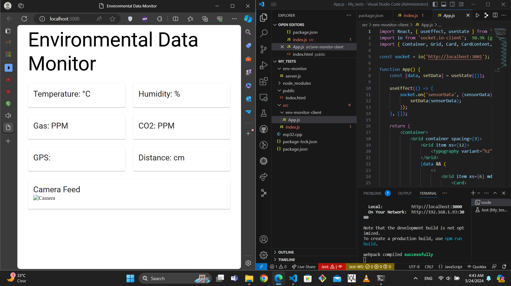

# Environmental Data Monitoring System

This project consists of a backend server to collect environmental data from various sensors and a frontend application to display the data in real-time. The project also includes an ESP32 code to read sensor data and send it to the server.

## Project Structure

- **Backend:** A Node.js server using Express and Socket.io to handle data from sensors.
- **Frontend:** A React application to display the collected data.
- **ESP32 Code:** Arduino code to read data from sensors and send it to the server.

## Setup

### Prerequisites

- Node.js and npm
- Arduino IDE

### Backend Setup

1. Navigate to the backend directory:
   ```sh
   cd env-monitor
   ```
2. Install the dependencies:
   ```sh
   npm install
   ```
3. Start the server:
   ```sh
   npm start
   ```

### Frontend Setup

1. Navigate to the frontend directory:
   ```sh
   cd env-monitor-client
   ```
2. Install the dependencies:
   ```sh
   npm install
   ```
3. Start the application:
   ```sh
   npm start
   ```

### ESP32 Setup

1. Open `Server-Sensors.cpp` in the Arduino IDE.
2. Configure your WiFi settings and server address.
3. Upload the code to your ESP32.

### ESP32 Code (Server-Sensors.cpp)

```cpp
#include <WiFi.h>
#include <WiFiClient.h>
#include <WebServer.h>
#include <ESPmDNS.h>
#include <Adafruit_GPS.h>
#include <SoftwareSerial.h>

// WiFi settings
const char *ssid = "...";
const char *password = "...";
const char* serverAddress = "192.168.x.x"; // IP address of your Raspberry Pi
const int serverPort = 3000;
WiFiClient client;

// Web server settings
WebServer server(80);

// Sensor pins
const int gasSensorPin = 32; // GPIO 32
const int tempPressureHumiditySensorPin = 33; // GPIO 33
const int measurePin = A0;
const int ledPower = 2;

// Motor control pins
const int rightMotor1 = 26;
const int rightMotor2 = 27;
const int rightMotor3 = 14;
const int leftMotor1 = 12;
const int leftMotor2 = 13;
const int leftMotor3 = 25;

// Ultrasonic sensor pins
const int trigPin = 26; // GPIO 26
const int echoPin = 27; // GPIO 27

// GPS settings
SoftwareSerial mySerial(3, 2); // RX, TX
Adafruit_GPS GPS(&mySerial);
char c;

void handleRoot() {
  int gasSensorValue = analogRead(gasSensorPin);
  int tempPressureHumiditySensorValue = analogRead(tempPressureHumiditySensorPin);
  
  char msg[1500];
  snprintf(msg, 1500,
           "<html>\
  <head>\
    <meta http-equiv='refresh' content='4'/>\
    <meta name='viewport' content='width=device-width, initial-scale=1'>\
    <link rel='stylesheet' href='https://use.fontawesome.com/releases/v5.7.2/css/all.css' integrity='sha384-fnmOCqbTlWIlj8LyTjo7mOUStjsKC4pOpQbqyi7RrhN7udi9RwhKkMHpvLbHG9Sr' crossorigin='anonymous'>\
    <title>ESP32 AlMonther's Server</title>\
    <style>\
    html { font-family: Arial; display: inline-block; margin: 0px auto; text-align: center;}\
    h2 { font-size: 3.0rem; }\
    p { font-size: 3.0rem; }\
    .units { font-size: 1.2rem; }\
    .BME-labels{ font-size: 1.5rem; vertical-align:middle; padding-bottom: 15px;}\
    </style>\
  </head>\
  <body>\
      <h2>ESP32 BME Server!</h2>\
      <p>\
        <i class='fas fa-thermometer-half' style='color:#ca3517;'></i>\
        <span class='BME-labels'>Temperature</span>\
        <span>%.2f</span>\
        <sup class='units'>&deg;C</sup>\
      </p>\
      <p>\
        <i class='fas fa-tint' style='color:#00add6;'></i>\
        <span class='BME-labels'>Humidity</span>\
        <span>%.2f</span>\
        <sup class='units'>&percnt;</sup>\
      </p>\
  </body>\
</html>", (float)tempPressureHumiditySensorValue, (float)gasSensorValue);

  server.send(200, "text/html", msg);
}

void setup() {
  Serial.begin(115200);
  delay(10);

  // WiFi setup
  WiFi.begin(ssid, password);
  while (WiFi.status() != WL_CONNECTED) {
    delay(500);
    Serial.println("Connecting to WiFi...");
  }
  Serial.println("Connected to WiFi");
  
  // Print the IP address
  Serial.println(WiFi.localIP());

  // MDNS setup
  if (MDNS.begin("esp32")) {
    Serial.println("MDNS responder started");
  }
  server.on("/", handleRoot);
  server.begin();
  Serial.println("HTTP server started");

  // Sensor pins setup
  pinMode(gasSensorPin, INPUT);
  pinMode(tempPressureHumiditySensorPin, INPUT);
  pinMode(measurePin, INPUT);
  pinMode(ledPower, OUTPUT);

  // Motor control pins setup
  pinMode(rightMotor1, OUTPUT);
  pinMode(rightMotor2, OUTPUT);
  pinMode(rightMotor3, OUTPUT);
  pinMode(leftMotor1, OUTPUT);
  pinMode(leftMotor2, OUTPUT);
  pinMode(leftMotor3, OUTPUT);

  // Ultrasonic sensor pins setup
  pinMode(trigPin, OUTPUT);
  pinMode(echoPin, INPUT);

  // GPS setup
  GPS.begin(9600);
  GPS.sendCommand(PMTK_SET_NMEA_OUTPUT_RMCGGA);
  GPS.sendCommand(PMTK_SET_NMEA_UPDATE_1HZ);
  delay(1000);
}

void loop() {
  server.handleClient();

  // Sensor readings
  int gasSensorValue = analogRead(gasSensorPin);
  int tempPressureHumiditySensorValue = analogRead(tempPressureHumiditySensorPin);
  float dustDensity = readDustDensity();
  float carbonMonoxideRatio = readCarbonMonoxideRatio();
  float distance = readUltrasonicDistance();

  // GPS readings
  clearGPS();
  while (!GPS.newNMEAreceived()) {
    c = GPS.read();
  }
  GPS.parse(GPS.lastNMEA());
  float latitude = GPS.latitudeDegrees;
  float longitude = GPS.longitudeDegrees;

  // Movement control
  moveForward();
  delay(2000); // Move forward for 2 seconds
  stopMoving();
  delay(1000); // Wait for 1 second

  // Send sensor data to server
  sendDataToServer(gasSensorValue, tempPressureHumiditySensorValue, dustDensity, carbonMonoxideRatio, distance, latitude, longitude);

  delay(1000); // Delay before next iteration
}

void moveForward() {
  // Right side motors
  digitalWrite(rightMotor1, HIGH);
  digitalWrite(rightMotor2, LOW);
  digitalWrite(rightMotor3, HIGH);

  // Left side motors
  digitalWrite(leftMotor1, LOW);
  digitalWrite(leftMotor2, HIGH);
  digitalWrite(leftMotor3, HIGH);
}

void stopMoving() {
  // Right side motors
  digitalWrite(rightMotor1, LOW);
  digitalWrite(rightMotor2, LOW);
  digitalWrite(rightMotor3, LOW);

  // Left side motors
  digitalWrite(leftMotor1, LOW);
  digitalWrite(leftMotor2, LOW);
  digitalWrite(leftMotor3, LOW);
}

float readDustDensity() {
  // Sensor reading logic
  return 0.0; // Placeholder value
}

float readCarbonMonoxideRatio() {
  // Sensor reading logic
  return 0.0; // Placeholder value
}

float readUltrasonicDistance() {
  // Sensor reading logic
  return 0.0; // Placeholder value
}

void sendDataToServer(int gasSensorValue, int tempPressureHumiditySensorValue, float dustDensity, float carbonMonoxideRatio, float distance, float latitude, float longitude) {
  if (client.connect(serverAddress, serverPort)) {
    String jsonData = "{\"gasSensorValue\":" + String(gasSensorValue) + ",\"tempPressureHumiditySensorValue\":" + String(tempPressureHumiditySensorValue) + ",\"dustDensity\":" + String(dustDensity) + ",\"carbonMonoxideRatio\":" + String(carbonMonoxideRatio) + ",\"distance\":" + String(distance) + ",\"latitude\":" + String(latitude, 6) + ",\"longitude\":" + String(longitude, 6) + "}";
    String httpRequest = "POST /update HTTP/1.1\r\nHost: " + String(serverAddress) + "\r\nContent-Type: application/json\r\nContent-Length: " + String(jsonData.length()) + "\r\n\r\n" + jsonData;
    client.print(httpRequest);
    client.stop();
  } else {
    Serial

.println("Connection failed");
  }
}

void clearGPS() {
  while (!GPS.newNMEAreceived()) {
    c = GPS.read();
  }
  GPS.parse(GPS.lastNMEA());

  while (!GPS.newNMEAreceived()) {
    c = GPS.read();
  }
  GPS.parse(GPS.lastNMEA());
}
```

## Features

- Real-time display of temperature, humidity, gas levels, carbon monoxide levels, GPS coordinates, and distance measurements.
- Web interface to visualize data using charts and graphs.
- Simple and clean design for easy monitoring.

## Screenshots




## License

This project is licensed under... Me lmao
```
